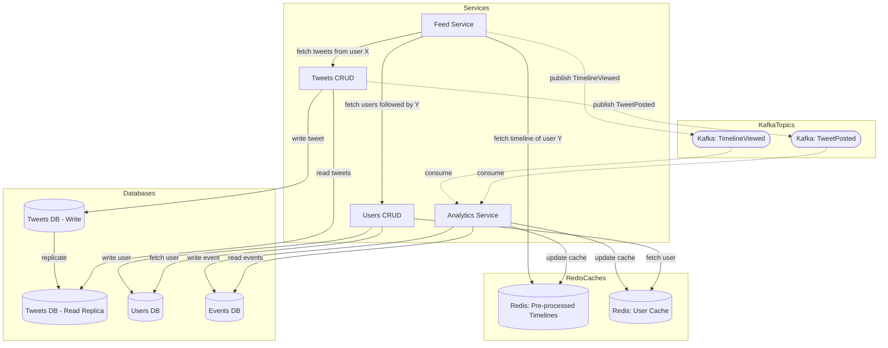
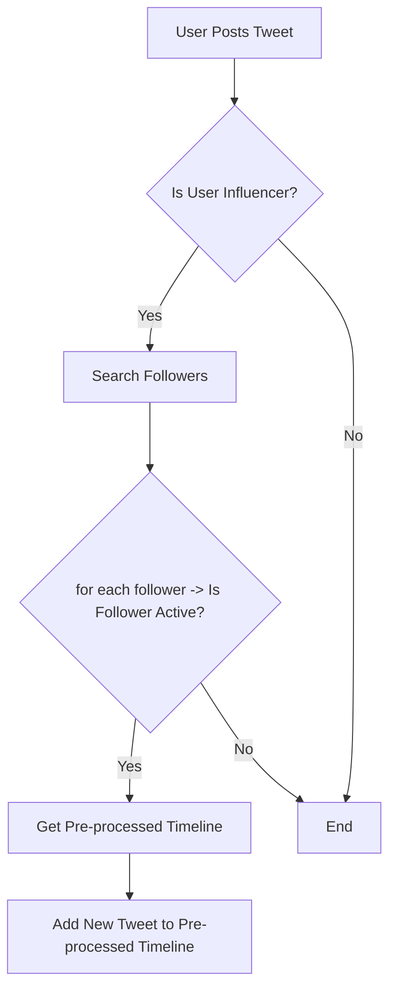
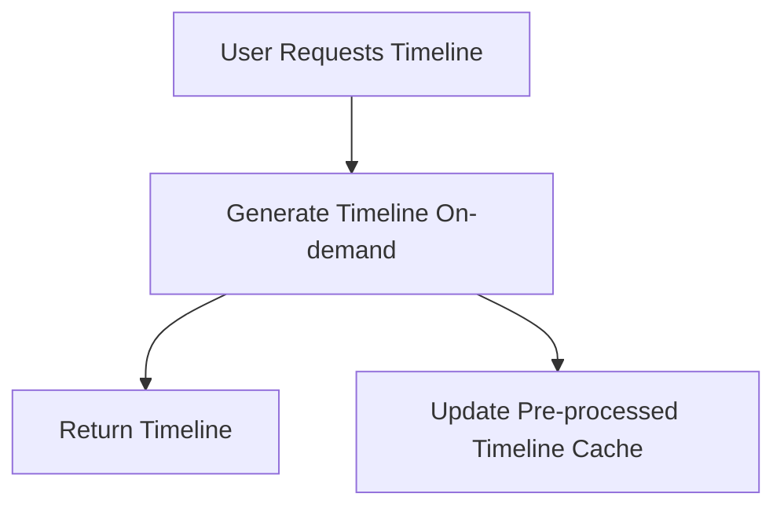
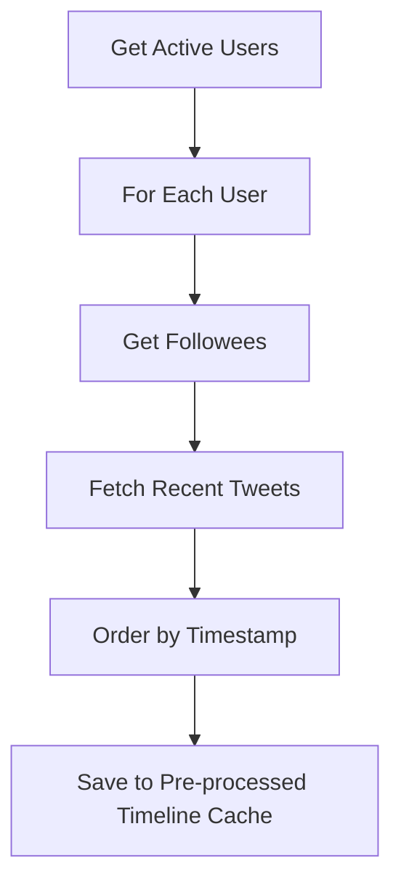

# Architecture

This architecture is a microservices architecture that allows users to post tweets, follow users and view their own timelines.
It is based on the assumptions defined in the [intro.md](intro.md) file.

The system is has 4 main services:

- Feed Service: Handles the timeline of users.
- Tweets CRUD: Handles the creation, reading, updating and deletion of tweets.
- Users CRUD: Handles the creation, reading, updating and deletion of users.
- Analytics Service: Handles events, hosts analytics logic and updates caches based on user activity.

The system has 2 main databases:

- Tweets DB: Stores the tweets of users. It has a replica for read operations.
- Users DB: Stores the users of the system.
- (extra database) Events DB: Stores the events of the system for future processing.

The system has 2 caches:

- Redis Pre-processed Timeline Cache: Stores the preloaded timelines of users.
- Redis User Cache: Stores the users of the system.

The architecture looks like this:

## Tweet Delivery Algorithm

The system implements a hybrid push-pull model for tweet delivery, optimized for both performance and freshness. The algorithm consists of three main flows:

### 1. On Tweet Post (Push for Influencers)

- When any user posts a tweet, the system checks if they are an influencer.
- For influencers, the system identifies active followers.
- The tweet is immediately pushed to the pre-processed timelines of active followers.
- Non-influencer tweets are only delivered when users request their timeline.

### 2. On Timeline Access (Pull)

- Any user's timeline can be generated on-demand when they access it.
- This ensures fresh content for all users, especially those who don't follow influencers.
- Used as a fallback for non-active users or when pre-processed data is unavailable.

### 3. Background Processing (Every 5 minutes)

- Runs as a scheduled job every 5 minutes.
- Identifies active users based on recent activity.
- Pre-calculates and caches timelines for active users.
- Improves performance for frequent users.

### Caching Strategy
- **Pre-calculated Timelines**: Stored in Redis for active users.
- **User Activity**: Tracks active users for optimized delivery.
- **Influencer Index**: Maintains a fast lookup of influencer accounts.
- **Cache Invalidation**: Timelines are updated on new tweets and during the background job.

### Performance Considerations
- **Write Amplification**: Minimized by only pushing to active followers.
- **Read Optimization**: Pre-calculated timelines reduce database load.
- **Freshness**: Hybrid model ensures a balance between performance and content freshness.

## Database Engine

| Component | Database Type | Engine | Justification |
| --- | --- | --- | --- |
| Tweets DB | NoSQL | Cassandra | Read scalability |
| Users DB  | Relational DB | PostgreSQL | Store user info + relationships (maybe graph DB to manage relationships and social connections or recomendations) |
| Events DB | NoSQL | BigQuery | Optimized for complex queries |
| Redis Caches | In-memory Key-Value Store | Redis | Low latency, fast cache updates |
