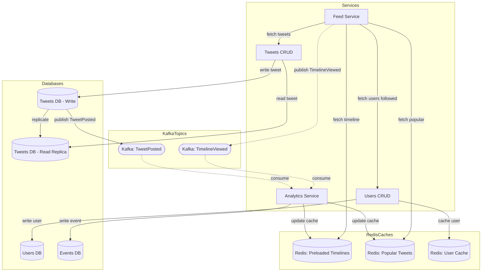

# Architecture

This architecture is a microservices architecture that allows users to post tweets, follow users and view their own timelines.
It is based on the assumptions defined in the [intro.md](intro.md) file.

The system is has 4 main services:

- Feed Service: Handles the timeline of users.
- Tweets CRUD: Handles the creation, reading, updating and deletion of tweets.
- Users CRUD: Handles the creation, reading, updating and deletion of users.
- Analytics Service: Handles events, hosts analytics logic and updates caches based on user activity.

The system has 2 main databases:

- Tweets DB: Handles the tweets of users.
- Users DB: Handles the users of the system.

The system has 3 caches:

- Redis Timeline Cache: Handles the preloaded timelines of users.
- Redis Popular Cache: Handles the popular tweets of the system.
- Redis User Cache: Handles the users of the system.

The architecture looks like this:

